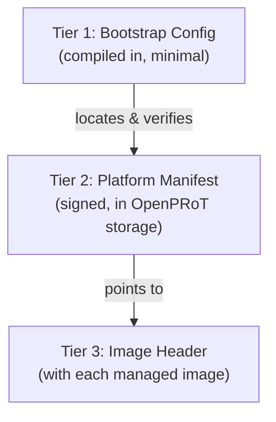

# OpenPRoT Managed-Device Configuration — Design Draft

> **Status:** Draft for team review
> **Scope:** Internal firmware design artifact. Not part of the Composable
> Security Architecture (CSA) specification — this document describes how a
> single OpenPRoT instance (an eRoT, a subsystem eRoT/AMC/EAM, a Module's
> on-card eRoT, or an iRoT configuration running on Caliptra MCU-class
> hardware) is configured to carry out the boot orchestration, resiliency,
> and attestation responsibilities defined in the CSA spec's
> [Admissible Architectures](../composable_security_architecture/src/admissible_architectures/README.md),
> [Resiliency](../composable_security_architecture/src/resiliency/README.md),
> [Boot Sequence](../composable_security_architecture/src/boot_sequence/boot_sequence.md),
> and [Attestation](../composable_security_architecture/src/attestation/README.md)
> chapters.

## 1. Design Principles

These were established through review and apply throughout the design below:

1. **Generic device indexing, not a device-type taxonomy.** OpenPRoT does not
   maintain an enumerated list of device kinds (CPU, GPU, BMC, NIC, ...). Every
   managed device is referenced by its position in the manifest's device list.
   Human-readable names exist only in the authoring format (see §7), not in
   the parsed runtime structure.
2. **Boot order is implicit in list order.** The order devices appear in the
   manifest's device list *is* the boot sequence. No separate priority field.
3. **Recovery-region membership is implicit, not tracked separately.**
   Multiple devices' images can be swapped atomically as a unit (see the
   `alt-bmc+bmc` dual-chip pattern in OpenBMC, or several PLDM components
   packed into one slot-swap unit). Rather than maintaining a parallel list of
   "which devices share a recovery region," each device simply references a
   shared `SlotGroup`. Two devices referencing the same `SlotGroup` *are* a
   recovery region by construction.
4. **Functional dependency (Cascading) is a separate, explicit concept from
   recovery-region sharing.** A device can depend on another device's
   operation without sharing any storage with it. This is modeled as an
   explicit dependency list, independent of `SlotGroup` membership.
5. **One addressing abstraction, reused everywhere.** Reset control,
   boot-progress signaling, update delivery, and attestation addressing all
   reduce to "how do I reach this device" — a single `Endpoint` type (or a
   narrowed protocol-specific variant of it) is reused across all of them
   instead of four parallel ad hoc address representations.
6. **Countersignature trust is global to the OpenPRoT instance, not
   per-device.** OpenPRoT wraps a single countersignature (platform-vendor-
   or owner-controlled key) around whatever internal signing scheme each
   IHV uses for its own device firmware. OpenPRoT does not need to know or
   model the IHV's internal scheme — only its own countersignature algorithm
   and trust anchors, defined once per instance.
7. **Fixed-capacity, no_std-friendly collections.** All variable-length lists
   use bounded capacity (`heapless::Vec<T, N>` in the sketches below) — no
   heap allocation. Capacity constants shown are illustrative and should be
   tuned per target.
8. **Scoped per OpenPRoT instance.** Each eRoT / subsystem eRoT has its own
   manifest describing only the devices within its own FW Update / Recovery
   Boundary, consistent with the three-tier hierarchy in Admissible
   Architectures.
9. **Index stability is a tooling concern, not a runtime one.** Because
   devices, slot groups, and reporting channels are referenced by numeric
   index, a manifest authoring/build tool must keep those indices stable
   across edits (e.g. by using named IDs in a human-authored source format
   and compiling them down to indices). The runtime types below intentionally
   do not solve this.

## 2. Three-Tier Data Model

Firmware/device configuration data splits across three tiers with different
volatility and trust-establishment order:

| Tier | Where it lives | Changes | Established by |
|---|---|---|---|
| **1 — Bootstrap** | Compiled into OpenPRoT firmware itself | Only on rebuild; kept minimal | Immutable boot ROM |
| **2 — Platform Manifest** | Signed data file in OpenPRoT's own storage | Rarely — board/topology-level, not build-version-level | Verified as part of OpenPRoT's own trusted state |
| **3 — Image Header** | Carried with each managed image (own storage, possibly a different flash device than OpenPRoT's) | Every firmware build/version | Verified once OpenPRoT (or the device's iRoT) parses it |

The tier 2/3 boundary specifically: Tier 2 holds things **unlikely to
change** — where a region lives and its **maximum allowed size**. Tier 3
holds things that **do change per build** — the image's **actual size**,
version/SVN, and which byte ranges are excluded from the countersignature
hash. This keeps manifest churn low even as individual device firmware is
updated frequently.



## 3. Common Primitives

```rust
/// Index into a PlatformManifest's device list. Also the device's boot-order
/// position — devices are released from reset in list order.
pub type DeviceIndex = u8;

/// Index into a PlatformManifest's slot_groups table.
pub type SlotGroupId = u8;

/// Index into a PlatformManifest's reporting_channels table.
pub type ReportingChannelId = u8;

/// A reachability address for a managed device, used for control and
/// monitoring purposes. Extensible without breaking existing configs when a
/// new transport is added.
pub enum Endpoint {
    Gpio(GpioEndpoint),
    Mctp(MctpEndpoint),
    I2c(I2cEndpoint),
    I3c(I3cEndpoint),
    /// Extension point for transports not yet enumerated (e.g. PCIe DOE).
    Vendor(VendorEndpoint),
}

pub struct GpioEndpoint {
    pub controller: u8,
    pub pin: u16,
    pub active_low: bool,
}

/// SPDM and PLDM Type 5 are both mandated over MCTP in this architecture, so
/// this narrower type (rather than the general `Endpoint`) is used wherever
/// a field is specifically an MCTP-transported protocol address.
pub struct MctpEndpoint {
    pub bus: u8,
    pub eid: u8,
}

pub struct I2cEndpoint {
    pub bus: u8,
    pub address: u16, // 7- or 10-bit
}

pub struct I3cEndpoint {
    pub bus: u8,
    pub dynamic_address: u8,
}

pub struct VendorEndpoint {
    pub vendor_id: u32,
    pub data: [u8; 8],
}
```

## 4. Storage, Redundancy, and Recovery Regions

```rust
pub enum StorageBackend {
    SpiFlash(SpiFlashLocation),
    Eeprom(I2cEndpoint),
    Streaming(StreamingSource),
    Vendor(VendorEndpoint),
}

pub struct SpiFlashLocation {
    pub bus: u8,
    pub chip_select: u8,
}

pub struct StreamingSource {
    /// Endpoint of the agent serving the image (typically this OpenPRoT
    /// instance itself, or a provisioning service reachable over MCTP).
    pub agent: Endpoint,
    /// Present for the hybrid model: stream once, then persist to local
    /// flash for subsequent boots.
    pub hybrid_fallback_to_flash: Option<SpiFlashLocation>,
}

/// A fixed physical region reserved for one firmware image slot. Describes
/// *capacity*, not the currently installed image — actual size/version live
/// in the Tier 3 image header, since those change every build.
pub struct ImageRegion {
    pub backend: StorageBackend,
    pub offset: u32,
    pub max_size: u32,
}

pub struct Slot {
    pub label: SlotLabel,
    pub region: ImageRegion,
}

/// Not limited to two — A/B/C is supported, though A/B is the common case.
pub enum SlotLabel {
    A,
    B,
    C,
    D,
}

/// A redundant image storage unit that may be referenced by more than one
/// managed device when their images are swapped atomically as a single unit
/// (e.g. several PLDM components packed into one slot-swap region, or a
/// device whose A and B slots live on entirely separate flash chips).
///
/// Devices referencing the same SlotGroupId form a recovery region *by
/// construction* — no separate tracked list is needed. Recovering one member
/// means recovering the whole group, since a slot switch affects all of them
/// simultaneously.
pub struct SlotGroup {
    pub slots: heapless::Vec<Slot, MAX_SLOTS_PER_GROUP>,
    /// Separately stored known-good image, distinct from the redundant
    /// slots above. Recommended when both A and B could plausibly be lost
    /// together; strongly recommended for OpenPRoT's own firmware (see
    /// Tier 1 bootstrap).
    pub golden_image: Option<ImageRegion>,
}
```

## 5. Boot Orchestration

```rust
pub struct ResetControl {
    pub endpoint: Endpoint,
}

pub struct BootCheckpoint {
    /// The signal or message expected to indicate this checkpoint was
    /// reached (e.g. a GPIO pulse, or an MCTP boot-progress message).
    pub signal: Endpoint,
    pub timeout_ms: u32,
}

pub struct BootMonitor {
    /// Ordered list of expected boot-progress checkpoints for this device.
    /// Exceeding a checkpoint's timeout without the expected signal is
    /// treated as a boot failure and triggers FailurePolicy.
    pub checkpoints: heapless::Vec<BootCheckpoint, MAX_CHECKPOINTS>,
}
```

## 6. Failure Handling

```rust
pub enum FailureAction {
    /// Skip this device; continue booting/operating the rest of the platform.
    Isolable,
    /// Skip this device and every device listed in its `deps`; continue
    /// booting/operating the remainder.
    Cascading,
    /// Halt the boot sequence entirely; enter out-of-band recovery.
    PlatformHalt,
}

pub struct FailurePolicy {
    pub max_retries: u8,
    pub on_exhaustion: FailureAction,
}
```

The dependency list used by `Cascading` lives on `ManagedDevice` itself
(§10), separate from `SlotGroup` membership (§4) — see Design Principle 4.

## 7. Reporting

```rust
pub enum Severity {
    Info,
    Warning,
    Critical,
}

/// A channel to notify platform/datacenter management of a failure or
/// policy violation. Shared by boot/recovery failure reporting (this
/// section) and bus access-control violation reporting (§9).
pub struct ReportingChannel {
    pub endpoint: Endpoint,
    pub severity: Severity,
}
```

## 8. Attestation Delegation

```rust
pub enum AttestationSource {
    /// No independent runtime attestation exists for this device. The
    /// measurement captured during boot-time authentication (before release
    /// from reset) is this device's only evidence contribution; OpenPRoT
    /// reports it on the device's behalf as a Target Environment triple in
    /// its own Evidence. This is the only path available for symbiont
    /// devices — there is no runtime SPDM to query.
    MeasuredAtBoot,
    /// Device has its own active RoT and responds to SPDM GET_MEASUREMENTS
    /// directly at runtime.
    ActiveSpdm { endpoint: MctpEndpoint },
}
```

## 9. Anti-Rollback

```rust
pub enum AntiRollbackPolicy {
    /// OpenPRoT enforces anti-rollback for this device using its own
    /// persistent counter storage. Whether the downstream device also
    /// tracks an SVN counter independently is irrelevant to this config —
    /// OpenPRoT does not need to know.
    EnforcedByOpenPRoT { counter: CounterStorage },
    /// OpenPRoT takes no role in anti-rollback for this device; entirely
    /// delegated to the device's own mechanism, if any.
    DelegatedToDevice,
}

pub enum CounterStorage {
    /// Counter lives in the *downstream device's* own OTP/fuse storage, but
    /// OpenPRoT is still the one enforcing/checking it (e.g. reading it over
    /// a management interface before authorizing an update).
    DeviceOtp { index: u16 },
    /// Authoritative record maintained by OpenPRoT itself — required for
    /// streaming-boot devices with no local OTP.
    OpenPRoTPersistent { key: u16 },
}
```

## 10. Bus Access Control

```rust
pub enum AccessOp {
    Read,
    Write,
    Erase,
}

pub struct AddressRange {
    pub offset: u32,
    pub length: u32,
}

pub struct RegionAccessRule {
    pub range: AddressRange,
    pub allowed: heapless::Vec<AccessOp, 3>,
}

pub struct SpiAccessPolicy {
    pub region_rules: heapless::Vec<RegionAccessRule, MAX_REGION_RULES>,
    /// Allow-list of permitted opcodes; anything else is denied by default
    /// and reported via `ReportingChannel`.
    pub allowed_opcodes: heapless::Vec<u8, MAX_SPI_OPCODES>,
}

pub struct I2cFilterRule {
    pub address: u16,
    /// `None` applies the rule to all commands at this address.
    pub command: Option<u8>,
    pub action: FilterAction,
}

pub enum FilterAction {
    Allow,
    Deny,
}

/// Extensible per-bus filtering policy. Adding a new bus type is a new enum
/// variant, not a breaking change to unrelated config.
pub enum BusAccessPolicy {
    Spi(SpiAccessPolicy),
    I2c(heapless::Vec<I2cFilterRule, MAX_I2C_RULES>),
    I3c(heapless::Vec<I2cFilterRule, MAX_I2C_RULES>),
    Vendor(VendorEndpoint),
}
```

## 11. Firmware Update Delivery

```rust
/// All downstream managed devices are updated via PLDM Type 5 over MCTP —
/// this is fixed by current plan, not per-device configurable.
pub struct ManagedDeviceUpdate {
    pub endpoint: MctpEndpoint,
}

/// OpenPRoT's own firmware update may use the same PLDM Type 5/MCTP path, or
/// a distinct mechanism (e.g. a dedicated SPI programming interface) if the
/// instance doesn't support self-update over PLDM.
pub enum SelfUpdateChannel {
    PldmType5Mctp { endpoint: MctpEndpoint },
    Direct(StorageBackend),
}
```

## 12. Countersignature Policy (Global, Per Instance)

```rust
pub enum SignatureAlgorithm {
    EcdsaP256Sha256,
    EcdsaP384Sha384,
    RsaPss2048Sha256,
    RsaPss4096Sha384,
    // extensible
}

pub enum KeyMaterial {
    PublicKey(heapless::Vec<u8, MAX_KEY_BYTES>),
    KeyHash(heapless::Vec<u8, MAX_HASH_BYTES>),
}

pub struct TrustAnchor {
    pub key_id: u32,
    pub material: KeyMaterial,
}

/// One policy for the whole OpenPRoT instance. OpenPRoT verifies a single
/// countersignature (platform-vendor- or owner-controlled) wrapped around
/// each downstream device's image, regardless of what internal signing
/// scheme the IHV uses for that device — OpenPRoT does not model the IHV's
/// internal scheme at all.
pub struct CountersignaturePolicy {
    pub algorithm: SignatureAlgorithm,
    pub trust_anchors: heapless::Vec<TrustAnchor, MAX_TRUST_ANCHORS>,
}
```

## 13. Managed Device (Tier 2 composite)

```rust
pub struct ManagedDevice {
    pub slot_group: SlotGroupId,
    pub reset_control: ResetControl,
    pub boot_monitor: BootMonitor,
    pub failure_policy: FailurePolicy,
    /// Devices this one functionally depends on, consulted only when this
    /// device's FailureAction is `Cascading`. Independent of `slot_group`.
    pub deps: heapless::Vec<DeviceIndex, MAX_DEPENDENCIES>,
    pub reporting: ReportingChannelId,
    pub attestation: AttestationSource,
    pub anti_rollback: AntiRollbackPolicy,
    pub update: ManagedDeviceUpdate,
    pub access_policy: Option<BusAccessPolicy>,
    pub integrity_poll: IntegrityPollPolicy, // placeholder — see §15
}
```

## 14. Top-Level Types

```rust
/// Tier 2 — signed platform manifest, stored in OpenPRoT's own storage.
/// One per OpenPRoT instance (node eRoT, subsystem eRoT, or Module eRoT).
pub struct PlatformManifest {
    /// List order is boot order; list position is DeviceIndex.
    pub devices: heapless::Vec<ManagedDevice, MAX_MANAGED_DEVICES>,
    pub slot_groups: heapless::Vec<SlotGroup, MAX_SLOT_GROUPS>,
    pub reporting_channels: heapless::Vec<ReportingChannel, MAX_REPORTING_CHANNELS>,
    pub countersignature: CountersignaturePolicy,
    pub self_update: SelfUpdateChannel,
    pub streaming_boot: Option<StreamingBootPolicy>, // placeholder — see §15
}

/// Tier 1 — compiled into OpenPRoT firmware. Kept to the minimum needed for
/// the immutable boot anchor to establish OpenPRoT's own chain of trust
/// before any data-driven config can be loaded and trusted.
pub struct BootstrapConfig {
    pub own_slot_group: SlotGroup,
    pub own_anti_rollback_otp_index: u16,
    pub manifest_location: ImageRegion,
    // Open question — see §16.1 — whether a separate trust anchor for the
    // manifest itself belongs here, or whether the manifest is authenticated
    // as part of OpenPRoT's own firmware verification chain.
}

/// Tier 3 — OpenPRoT-specific fields carried in a managed image's own
/// header, layered on top of identification already defined by DMTF PLDM
/// Type 5 (component classification, version string, comparison stamp,
/// etc. — not reproduced here). Changes on every firmware build.
pub struct ImageHeader {
    pub svn: u32,
    pub actual_size: u32,
    /// Byte ranges excluded from the countersignature hash (e.g. a
    /// per-unit serial number stamped in after signing).
    pub signature_exclusions: heapless::Vec<AddressRange, MAX_EXCLUSIONS>,
}
```

## 15. Explicit Placeholders (Not Yet Designed)

These were flagged during review as needed but not yet fleshed out:

- **`IntegrityPollPolicy`** — background/at-rest integrity polling per
  device (interval, jitter/scheduling, whether active and inactive slots are
  polled at the same cadence). Referenced in §13 as a placeholder field.
- **`StreamingBootPolicy`** — beyond the `StreamingSource` addressing in §4,
  the full policy around streaming boot (freshness/timeout handling,
  hybrid-mode transition triggers, behavior when the serving agent is
  unavailable) needs further design. Referenced in §14 as a placeholder
  field.

## 16. Open Questions for Team Review

### 16.1 Manifest self-authentication

The Platform Manifest (Tier 2) needs to be trusted before its contents
(including the downstream countersignature trust anchors in §12) can be
used. Two options:

- The manifest is authenticated as part of OpenPRoT's own firmware
  verification chain (e.g. bundled into or covered by the same signature as
  OpenPRoT's own A/B slot image) — no separate trust anchor needed.
- The manifest is an independently signed artifact with its own signing key,
  which would need a trust anchor compiled into `BootstrapConfig` (Tier 1).

This determines whether `BootstrapConfig` needs a trust-anchor field, and
whether manifest updates can be delivered independently of an OpenPRoT
firmware update.

### 16.2 Capacity constants

All `MAX_*` constants above are illustrative placeholders. These need real
values once target device counts, slot group counts, dependency depth, etc.
are known — likely to differ across the Module / Single Node / Complex
Heterogeneous system models.

### 16.3 Crate choice for fixed-capacity collections

The sketches use `heapless::Vec` for bounded collections. Worth confirming
as the team's choice given anything in the manifest-parsing path is part of
the TCB — alternatives include hand-rolled const-generic arrays with an
explicit length field.

## 17. Traceability to Original Requirements List

| # | Original item | Where it lives |
|---|---|---|
| 1 | Device containing image | `StorageBackend`, `ImageRegion` (§4) |
| 2 | Location/length within device | `ImageRegion.offset` (Tier 2, max size) + `ImageHeader.actual_size` (Tier 3) |
| 3 | Redundant partitions, same/different device, count | `SlotGroup.slots` (§4) |
| 4 | Devices sharing a partition (recovery region) | Implicit via shared `SlotGroupId` (§4, Design Principle 3) |
| 5 | Golden/recovery image | `SlotGroup.golden_image` (§4) |
| 6 | Reset hold/release mechanism | `ResetControl` (§5) |
| 7 | Boot-progress monitoring + timeout | `BootMonitor`, `BootCheckpoint` (§5) |
| 8 | Critical vs. continue-on-failure | Merged into `FailurePolicy` (§6) |
| 9 | Notify datacenter infrastructure | `ReportingChannel` (§7) |
| 10 | Retry/reboot/halt policy | `FailurePolicy`, `FailureAction` (§6) |
| 11 | OpenPRoT-on-behalf vs. device-native attestation | `AttestationSource` (§8) |
| 12 | Signature scope exclusions | `ImageHeader.signature_exclusions` (Tier 3, §14) |
| 12a | Countersignature algorithm + trust anchors (added during review) | `CountersignaturePolicy` (§12) |
| 13 | Read/write/erase region map | `RegionAccessRule`, `AccessOp` (§10) |
| 14 | SPI opcode allow/deny + reporting | `SpiAccessPolicy` (§10) |
| 15 | I2C/I3C command/address filtering + reporting | `I2cFilterRule`, `BusAccessPolicy` (§10) |
| — | Device type taxonomy | Deliberately omitted — generic `DeviceIndex` only (Design Principle 1) |
| — | Boot order | Implicit in device list order (Design Principle 2) |
| — | Functional (Cascading) dependency | `ManagedDevice.deps` (§13) |
| — | Anti-rollback counter location | `AntiRollbackPolicy`, `CounterStorage` (§9) |
| — | Update delivery channel | `ManagedDeviceUpdate`, `SelfUpdateChannel` (§11) |

---

# Part II — Caliptra MCU Compatibility Considerations

> This part covers a near-term compatibility goal: OpenPRoT firmware is
> being made to run as an iRoT configuration on Caliptra MCU-class
> hardware, with an appropriate board support package, providing the same
> Recovery/RoT-services/platform-integration functionality that Caliptra
> MCU firmware provides today. This part defines how Part I's design
> aligns with — and where useful, adopts structural patterns from —
> Caliptra MCU's own firmware image and configuration model, so that work
> can start now rather than being deferred.
>
> **Caveat on sourcing:** this revision verified the structural claims
> below directly against a local clone of `chipsalliance/caliptra-mcu-sw`
> (docs under `docs/src/`, and source in `common/flash-image/`,
> `romtime/`, `runtime/userspace/api/measurement-api/`,
> `platforms/emulator/config/`, `builder/`, and `xtask/`). Exact struct
> layouts for the flash image Header/Image Header, the MCU Component SVN
> Manifest, and the Attestation Manifest are now confirmed from source,
> not paraphrased from docs or search results. One piece remains
> unverified: the canonical `Preamble`/`AuthManifestImageMetadataCollection`
> struct definitions live in the external `caliptra-auth-man-types` crate
> (a git dependency on `chipsalliance/caliptra-sw`, not vendored in this
> checkout and not present in any local Cargo git-checkout cache) — field
> *names* below come from `xtask/src/auth_manifest.rs`'s CLI parser, which
> is real evidence but not the struct source itself. Architectural claims
> tied to `caliptra-sw`/`caliptra-ss` issue numbers (format churn, BSP
> contract status) are still search-derived, since those repos were not
> available locally in this pass — called out again in §21/§22.

## 18. Caliptra MCU Architecture Summary

Caliptra MCU (`chipsalliance/caliptra-mcu-sw`) is a distinct microcontroller
subsystem alongside Caliptra Core (`chipsalliance/caliptra-sw` /
`caliptra-rtl`), together forming the "Caliptra Subsystem":

- **Caliptra Core** is the DICE root: fuses, firmware signature verification,
  measured boot, and attestation/crypto services exposed over a mailbox. It
  is deliberately silicon-agnostic.
- **Caliptra MCU firmware** is the SoC-facing manager — "Recovery, RoT
  Services, and Platform integration support." It drives the OCP
  Recovery/streaming-boot interface, orchestrates firmware update
  (PLDM/MCTP), stages SoC device firmware, and hosts the platform-specific
  glue Core does not implement. It has two stages:
  - **MCU ROM** — small bare-metal ROM that hands non-secret fuse data to
    Caliptra Core so Core can complete its own boot.
  - **MCU Runtime** — runs on **Tock OS** (a Rust embedded RTOS); hosts the
    PLDM/MCTP stacks, firmware-update state machine, SPDM responder
    support, DPE usage, and flash/recovery drivers as Tock capsules/apps.
- **MCI (Manufacturer Control Interface)** — hardware block providing SRAM,
  a restricted mailbox, control/status registers, a watchdog timer, and a
  **Boot Sequencing FSM** that coordinates reset deassertion between Core
  and MCU.

This maps reasonably well onto the CSA spec's own iRoT/eRoT vocabulary:
Caliptra Core is a per-SoC iRoT; Caliptra MCU is functionally an eRoT-like
orchestrator, just implemented as a companion microcontroller rather than a
fully discrete chip. When OpenPRoT runs as this iRoT configuration on
Caliptra MCU hardware, OpenPRoT's Tier 1 (`BootstrapConfig`, §14) is
analogous to MCU ROM's role, and the bulk of Part I's design (Tier 2
`PlatformManifest` and its orchestration logic) is analogous to what today
runs as MCU Runtime Tock capsules.

## 19. Concept Mapping

| Caliptra MCU / Core concept | Closest Part I equivalent | Fit |
|---|---|---|
| MCU ROM (hands fuses to Core, minimal) | `BootstrapConfig` (Tier 1, §14) | Close conceptual match |
| MCI Boot Sequencing FSM + Watchdog | `ResetControl` + `BootMonitor` (§5) | Close match; would need a new `Endpoint::Mci`-style variant (§3) rather than a structural change |
| SoC/Auth Manifest + Image Metadata Collection (IMC), dual vendor/owner signing, per-image `AUTHORIZE_AND_STASH` | `CountersignaturePolicy` (§12) + `ManagedDevice` list (§13) | Conceptually close, but IMC is richer — see §20.1 |
| Flash image: `FlashHeader` + per-image `ImageHeader` ("Image Information") records | `ImageRegion`/`Slot` (Tier 2, §4) **and** `ImageHeader` (Tier 3, §14) | Field layout now **verified from source** — see §20.2; the mapping is split across two Part I tiers, not one |
| MCU Component SVN Manifest (fixed 1024-byte, 126-entry anti-rollback record) | `AntiRollbackPolicy` / `CounterStorage` (§9) | Closer structural analog than anything found previously — see §20.2a |
| Attestation Manifest (build-time, vendor/model + per-`fw_id` TCB/AK-target flags) — **distinct artifact from the SoC/Auth Manifest** | `AttestationSource` (§8) | New finding: MCU keeps attestation-TCB routing as a separate artifact from firmware-update metadata — see §20.2b |
| Active/recovery two-region flash partitioning + `PartitionTable` (boot count, status, rollback flag) | `SlotGroup` / `Slot` (§4) | Part I's model is a **superset** — see §20.3 |
| MCU Runtime Firmware Format optional magic-prefixed headers (e.g. Device Ownership Transfer section), ROM-consumed before the reset vector | Not modeled in Part I | New pattern, no current gap — see §20.2c |
| DICE measurement stash (Core ROM API, 8-slot hardware limit) | `AttestationSource::MeasuredAtBoot` (§8) | Part I needs an explicit cap if backed by this hardware — see §20.4 (still unverified locally; Core lives in `caliptra-sw`, not cloned) |
| OCP Recovery / I3C or AXI streaming boot interface | `StreamingSource` (§4) | Already aligned in spirit |
| Tock "board" (per-SoC Rust source, compiled) | Not modeled in Part I (out of scope — Part I assumes OpenPRoT firmware is already built for its target) | No config-format equivalent exists upstream yet (§20.5) |

## 20. Where to Align, and Where to Wait

### 20.1 Countersignature policy — richer alternate structure

Caliptra's SoC/Auth Manifest pattern is a **dual-key**, revocation-aware
version of Design Principle 6 (§1) — worth adopting the shape independent
of the iRoT-on-MCU work:

```rust
// Alternate to §12's CountersignaturePolicy, modeled on Caliptra's
// Preamble + Image Metadata Collection (IMC) pattern.
pub struct DualKeyCountersignaturePolicy {
    pub algorithm: SignatureAlgorithm,
    pub vendor_key: TrustAnchor,
    pub owner_key: Option<TrustAnchor>,
    /// Per-device revocation, indexed the same as PlatformManifest.devices.
    /// Mirrors Caliptra's fuse-backed LMS/MLDSA revocation bitmasks.
    pub revoked: heapless::Vec<DeviceIndex, MAX_MANAGED_DEVICES>,
}
```

This does not replace §12 — it is presented as an **alternate** the team
can choose instead of the single-flat-list `CountersignaturePolicy`, if
vendor/owner key separation and per-device revocation are wanted now rather
than deferred.

The real field names, confirmed via `xtask/src/auth_manifest.rs`'s
`parse()` output against the `caliptra-auth-man-types::AuthorizationManifest`
type, are richer than the sketch above suggests: the Preamble carries
`marker`, `size`, `version`, `svn`, `flags`, and each Image Metadata Entry
carries `fw_id`, `component_id`, `classification`, `flags`,
`image_load_address` (`hi`/`lo`), `image_staging_address` (`hi`/`lo`), and
a `digest`. That's evidence the real IMC entry already bundles per-image
load/staging addresses and a digest alongside identity/classification —
closer to a merged view of this document's `ImageRegion` + `ImageHeader`
than a pure signature-policy structure. Still, the *canonical* struct
(byte widths, derive attributes, field order) lives in the external
`caliptra-auth-man-types` crate, which was not resolvable in this local
checkout (see the Part II caveat) — so this remains field-name-level
confidence, not byte-level.

**Do not** attempt to match Caliptra's on-the-wire IMC format itself yet:
`chipsalliance/caliptra-sw` issue **#2000** documents that the manifest's
own magic-marker convention is being changed between the 1.2 and 2.x format
generations (the 1.2 "NMTA" marker was discovered to be backwards, and the
2.x format is getting a new marker to accommodate MLDSA/post-quantum keys).
Byte-level compatibility today would be compatibility with a format known
to be mid-churn. (This citation is still search-derived — `caliptra-sw`
itself was not available to re-check in this pass.)

### 20.2 Image header — now verified, and the mapping needed correcting

The exact structures are confirmed straight from
`common/flash-image/src/lib.rs` (a `#![no_std]` crate using `zerocopy`
derives for safe zero-copy parsing):

```rust
#[repr(C)]
#[derive(Debug, FromBytes, IntoBytes, Immutable, KnownLayout)]
pub struct FlashHeader {
    pub version: u16,              // must equal HEADER_VERSION = 0x0002
    pub image_count: u16,
    pub image_headers_offset: u32,
    pub header_checksum: u32,      // wrapping-sub byte-sum of the fields above
}

#[repr(C)]
#[derive(Debug, FromBytes, IntoBytes, Clone, Copy, Immutable, KnownLayout)]
pub struct ImageHeader {
    pub identifier: u32,           // 0x0=Caliptra FMC+RT, 0x1=SoC Manifest,
                                    // 0x2=MCU RT, 0x1000+=vendor SoC images
    pub offset: u32,
    pub size: u32,
    pub image_checksum: u32,
    pub image_header_checksum: u32,
}
```

Two corrections to the earlier (search-based) version of this section:

1. **Doc/code discrepancy found:** `docs/src/flash_layout.md`'s prose table
   lists a 64-byte `Filename` field on the Image Information record (for
   TFTP-path network boot). The actual `ImageHeader` struct above has no
   such field — five `u32`s only, no filename. Worth flagging upstream;
   for our purposes, trust the struct over the doc's table.
2. **The concept-mapping row was wrong.** `ImageHeader` here has no
   version/SVN/build-metadata field at all — it is purely a *location +
   size + checksum* descriptor. That makes it structurally closer to this
   document's Tier 2 `ImageRegion` (§4) — "where a region lives, how big is
   its capacity" — than to Tier 3 `ImageHeader` (§14), which specifically
   holds things that change *per build* (SVN, actual size, signature
   exclusions). MCU's design puts SVN/version tracking elsewhere: in the
   SoC Manifest's `Preamble.svn` (§20.1) and, per §20.2a below, in the new
   MCU Component SVN Manifest — not in the flash Image Header at all. Part
   I's own Tier 2/Tier 3 split (§2) is consistent with this once corrected;
   no structural change needed, just the corrected mapping in §19.

### 20.2a Anti-rollback — MCU Component SVN Manifest is a strong analog

`romtime/src/component_svn_manifest.rs` defines a fixed-size, magic-prefixed
manifest that travels inside the (authenticated) MCU runtime image and
declares new `min_svn` OTP floors, verified from source:

```rust
#[repr(C)]
pub struct McuComponentSvnEntry {
    pub component_id: u32,   // same identifier Caliptra uses in AuthManifestImageMetadata
    pub current_svn: u16,
    pub min_svn: u16,        // requested new floor (0 = no update)
}

#[repr(C)]
pub struct McuComponentSvnManifest {
    pub magic: u32,                    // "VSCM" on disk / 0x4D43_5356
    pub format_version: u16,
    pub current_svn: u8,               // SVN of this header itself
    pub min_svn: u8,
    pub caliptra_runtime_min_svn: u8,  // requested new floor for CPTRA_CORE_RUNTIME_SVN
    pub soc_manifest_min_svn: u8,      // requested new floor for CPTRA_CORE_SOC_MANIFEST_SVN
    pub reserved: [u8; 6],
    pub entries: [McuComponentSvnEntry; 126], // 16B header + 126*8B = 1024B total, fixed size
}
```

This is a closer, more concrete analog to `AntiRollbackPolicy` /
`CounterStorage` (§9) than anything found in the earlier search-based
pass: a single fixed-size, `component_id`-indexed table of current/floor
SVN pairs, separate from the per-device OTP index Part I currently models
via `CounterStorage::DeviceOtp`. Worth considering as an **alternate**
`CounterStorage` variant — e.g. a manifest-backed table keyed by
`DeviceIndex` rather than per-device scattered OTP indices — the same way
§20.1 offers a dual-key alternate for `CountersignaturePolicy`. Not
proposed as a replacement; a team decision like §20.1's.

### 20.2b Attestation — a separate artifact Part I doesn't yet distinguish

`runtime/userspace/api/measurement-api/src/attestation_manifest.rs`
confirms the Attestation Manifest is a wholly distinct format from the
SoC/Auth Manifest, built at integration time and consumed only by the
Measurement API for TCB routing:

```rust
pub struct AttestationManifestHeader {
    pub marker: u32,        // 0x4d41_434d ("MCAM")
    pub size: u32,
    pub version: u32,
    pub header_size: u32,   // fixed at 228 (28B prefix + vendor[100] + model[100])
    pub entry_count: u32,
    pub tcb_entry_count: u32,
    pub vendor_len: u16,
    pub model_len: u16,
}

pub struct AttestationManifestEntry {
    pub fw_id: u32,
    pub attestation_flags: u32, // bit 0: SOC_TCB_DPE, bit 1: AK_TARGET
}
```

Each entry says whether a firmware component is part of the SoC TCB
(measured through the DPE-backed path) and, at most once platform-wide,
which TCB entry is the attestation-key target. This is a finding Part I's
`AttestationSource` (§8) doesn't currently distinguish: `AttestationSource`
answers *"does this device have runtime SPDM, or is it measured-at-boot,"*
per device — but says nothing about which devices form the attestation
TCB, or which one anchors the attestation key. If OpenPRoT's own
attestation evidence assembly needs that distinction (likely, once DPE or
an equivalent is in the picture), it may be worth a separate
`AttestationTcbManifest`-style artifact alongside `AttestationSource`
rather than folding TCB/AK-target flags into the per-device enum. Flagging
as a design question for the team, not a decision made here.

### 20.2c Firmware format optional headers — prior art, not a current gap

`docs/src/firmware_format.md` (and `rom/src/device_ownership_transfer.rs`)
describe magic-prefixed headers optionally prepended to the MCU runtime
image ahead of its reset vector — e.g. a "Firmware Manifest DOT Section"
gating privileged, idempotent, one-way Device Ownership Transfer
operations (lock/unlock/rotate/disable), each independently detected by
its own magic and gated by a Cargo feature and a runtime flag. This is a
"self-describing header chain" pattern with no current Part I equivalent.
Part I doesn't yet have a concept of privileged one-way post-authentication
operations gated this way, so there's nothing to align today — noting it
here as prior art worth revisiting only if such a need arises.

### 20.3 Slot model — Part I is already the more general design

MCU's flash redundancy is a coarse **two-region** (active/recovery)
partition. The concrete `PartitionTable` struct, confirmed in
`platforms/emulator/config/src/flash.rs`, is:

```rust
#[repr(C, packed)]
pub struct PartitionTable {
    pub active_partition: u32,       // PartitionId::A or ::B
    pub partition_a_boot_count: u16,
    pub partition_a_status: u16,     // PartitionStatus: Invalid/Valid/BootFailed/BootSuccessful
    pub partition_b_boot_count: u16,
    pub partition_b_status: u16,
    pub rollback_enable: u32,
    pub reserved: u32,
    pub checksum: u32,
}
```

Part I's `SlotGroup`/`Slot` model (§4) — arbitrary A/B/C/D slots,
optionally spanning separate physical devices, plus an independent golden
image — is a strict superset of this two-region, no-golden-image table.
No change needed on our side; when OpenPRoT runs the iRoT configuration on
this hardware, MCU's flash layout needs to grow *into* this model rather
than the reverse. One caveat
found this pass: this exact struct lives under `platforms/emulator/`,
i.e. it is the reference/emulator platform's partition table, not
necessarily a single canonical format guaranteed to be identical across
every MCU-based SoC integration — worth re-confirming against a
non-emulator platform if one becomes available before treating it as *the*
MCU partition table format.

### 20.4 Attestation stash limit — a real hardware constraint to carry forward

Caliptra Core's measurement-stash mailbox API supports **at most eight**
pre-Runtime measurements (a fuse/hardware-enforced limit), explicitly
called out as covering "any security-sensitive code or configuration
loaded by the MCU before Caliptra RT firmware boots." When OpenPRoT runs
on Caliptra MCU hardware and backs `MeasuredAtBoot` (§8) with this stash,
the number of symbiont devices using that path is capped at 8
platform-wide — not per-device configurable. Recommendation: track this
as a documented constant now (e.g.
`const MAX_MEASURED_AT_BOOT_DEVICES: usize = 8;`), and treat exceeding it
as a manifest-build-time error rather than a runtime condition.

### 20.5 Board support / porting contract — nothing to align to yet

`chipsalliance/caliptra-mcu-sw` issue **#865** shows an integrator asking
maintainers to confirm the expected directory layout and minimal interface
for porting to new silicon — indicating **no finalized BSP/porting
contract exists yet** upstream. There is currently no stable extension
surface for "OpenPRoT running as MCU firmware on new hardware" to target.
This is a blocking dependency for shipping the iRoT-on-MCU configuration,
independent of any manifest-format decision — worth raising with the
Caliptra MCU maintainers directly given the near-term timeline.

## 21. Recommendation

- **Adopt now, low risk:** the concept mapping in §19, and specifically the
  extensibility already built into Part I (§3's `Endpoint` enum, §4's
  `SlotGroup`) comfortably accommodates MCI/Caliptra-flavored variants
  later without breaking changes.
- **Consider now, team decision:** three independently-adoptable alternates
  surfaced by this research, none contingent on MCU absorption happening:
  - swapping §12's flat `CountersignaturePolicy` for the dual-key /
    revocation-aware alternate in §20.1;
  - a manifest-backed, `component_id`/`DeviceIndex`-keyed `CounterStorage`
    alternate modeled on the MCU Component SVN Manifest (§20.2a);
  - separating attestation-TCB/AK-target membership from the per-device
    `AttestationSource` enum into its own artifact, modeled on the
    Attestation Manifest (§20.2b).
- **Now confirmed compatible without changes:** Part I's Tier 2/Tier 3
  split (§2) already separates "where/how big" (`ImageRegion`) from
  "what changed this build" (`ImageHeader`) the same way MCU splits its
  flash `ImageHeader` (location/size only) from its SVN/version tracking
  (SoC Manifest `Preamble.svn`, MCU Component SVN Manifest) — no structural
  gap here once the corrected mapping in §19/§20.2 is used.
- **Defer:** byte-level wire compatibility with the SoC/Auth Manifest
  (Preamble + IMC) specifically. Rationale, partially re-confirmed this
  pass: the canonical struct source (`caliptra-auth-man-types`) still
  couldn't be located locally, and the format-churn concern
  (`caliptra-sw#2000`) and the open "does MCU RT need its own manifest"
  question (`caliptra-ss#481`) are both about *this* artifact specifically
  — neither claim could be re-checked against `caliptra-sw`/`caliptra-ss`
  in this pass, since only `caliptra-mcu-sw` was cloned locally.
- **Lower-risk than previously assessed:** byte-level alignment with the
  flash `FlashHeader`/`ImageHeader` pair (§20.2), the MCU Component SVN
  Manifest (§20.2a), and the Attestation Manifest (§20.2b) specifically —
  these are all `caliptra-mcu-sw`-local formats, not subject to the
  `caliptra-sw#2000` churn, and are now byte-verified from source. These
  three are the lowest-risk starting points if the team wants to move on
  byte compatibility now.
- **Still blocking for shipping the iRoT-on-MCU configuration, regardless
  of manifest format:** no finalized porting/BSP contract
  (`caliptra-mcu-sw#865`) and no shipped first milestone as of the last
  check (`caliptra-mcu-sw#846`) — both issue-tracker claims, not
  re-verified this pass. Worth raising directly with upstream given the
  near-term timeline.
- **Track as watch items:** `caliptra-sw#2000`, `caliptra-ss#481`,
  `caliptra-mcu-sw#865`, `caliptra-mcu-sw#846`.

## 22. Follow-Up Research Needed

Resolved this pass, via direct local clone of `chipsalliance/caliptra-mcu-sw`:

- ✅ Exact field-level layout of the flash image `FlashHeader` and
  `ImageHeader` ("Image Information") records — confirmed from
  `common/flash-image/src/lib.rs` (§20.2), including a doc/code
  discrepancy (`docs/src/flash_layout.md` lists a Filename field the
  struct doesn't have).
- ✅ Exact layout of the MCU Component SVN Manifest (§20.2a) and the
  Attestation Manifest (§20.2b) — both confirmed from source; both were
  entirely unknown in the prior search-based pass.
- ✅ Reset-control-over-downstream-devices: appears to be hardware-register
  based (MCI `RESET_REQUEST.mcu_req` / `RESET_STATUS.MCU_RESET_STS` /
  `FW_EXEC_CTRL` bits per `docs/src/firmware_update.md`'s Hitless Update
  Reset flow), not manifest-encoded — resolved with reasonably high
  confidence, though not exhaustively (no evidence of a counter-example
  found, but absence of evidence isn't proof).

Partially resolved:

- 🟡 Preamble / IMC / Image Metadata Entry struct: field *names* now known
  with high confidence via `xtask/src/auth_manifest.rs`'s `parse()`
  function (§20.1) — but the canonical struct definition (byte widths,
  derive attributes, exact field order) lives in the external
  `caliptra-auth-man-types` crate, which is a git dependency on
  `chipsalliance/caliptra-sw` and was not found in any local Cargo
  git-checkout cache. Closing this out needs either a local clone of
  `caliptra-sw` itself, or a populated Cargo dependency cache for this
  workspace (e.g. after running `cargo fetch`/`cargo build` once).

Still open — requires resources not cloned in this pass:

- Current resolution status of `caliptra-ss#481`'s "does MCU RT need its
  own manifest separate from the SoC Manifest" question — `caliptra-ss`
  was not cloned locally.
- Current status of the `caliptra-sw#2000` manifest magic-marker churn
  (1.2 "NMTA" → 2.x MLDSA-ready format) — `caliptra-sw` was not cloned
  locally; this citation is still as originally found via search.
- Whether `caliptra-mcu-sw#865` (BSP/porting contract) or `#846` (first
  milestone) have progressed since originally found via search — worth a
  quick issue-tracker check before finalizing any absorption decision,
  independent of manifest-format work.
